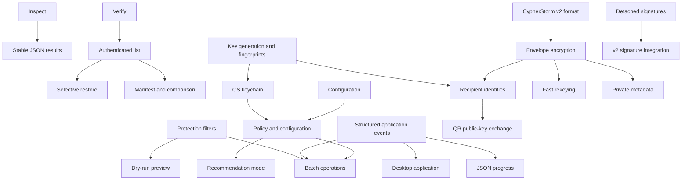

# CypherStorm Product Roadmap

This roadmap covers the complete product expansion proposed for CypherStorm while preserving the current security and architectural boundaries.

## Scope

The roadmap includes:

1. `inspect` command
2. `verify` command
3. authenticated archive listing
4. selective restoration
5. protection filters and dry-run
6. built-in key generation and fingerprints
7. OS keychain integration
8. credential hints and key fingerprints
9. public-key recipient encryption
10. envelope encryption and fast rekeying
11. authenticated private metadata
12. detached signatures
13. machine-readable JSON
14. structured progress output
15. policy profiles
16. configuration files
17. batch protection and restoration
18. manifests and change detection
19. restore conflict policies
20. post-protection verification
21. compression recommendation mode
22. shell completion and manual pages
23. QR-based public-key exchange
24. an optional desktop application

The following previously discussed proposals are deliberately not normal roadmap deliverables: portable secure deletion, transparent filesystem mounting, encrypted deduplication, implicit source replacement, and provider-specific cloud integrations. Their disposition is documented under [Deferred and rejected proposals](#deferred-and-rejected-proposals).

## Security and compatibility invariants

Every milestone must preserve these rules:

- Existing CypherStorm v1 artifacts remain restorable.
- The v1 byte format and cryptographic semantics do not change.
- Format-breaking capabilities are introduced only through an explicitly versioned v2 format.
- CLI, TUI, and any future desktop application remain adapters over `internal/app`.
- CLI and UI adapters never implement independent container, cryptographic, archive, or publication logic.
- Untrusted lengths, counts, KDF parameters, metadata, recipient tables, and archive entries are bounded before allocation or expensive work.
- Protect, restore, rekey, key generation, and destination-changing operations remain transactional.
- No operation publishes unauthenticated or incomplete output.
- Passwords, raw keys, private identities, and derived keys never enter command arguments, logs, reports, configuration, JSON results, progress events, or error messages.
- Cancellation waits for private staging cleanup before returning control.
- Symlinks are never followed during source traversal and never used to escape extraction or publication roots.
- New dependency surface is justified, pinned compatibly, vulnerability-scanned, and isolated from cryptographic policy where possible.

## Architectural baseline

The current dependency direction remains authoritative:

```text
cmd/cypherstorm/main.go
        |
        +-- internal/ui/cli
        +-- internal/ui/tui
                  |
                  v
            internal/app
                  |
      +-----------+------------+
      |           |            |
      v           v            v
internal/crypto internal/archive internal/fsutil
      |           |
      v           v
internal/format internal/compress
```

Current extension seams:

- `internal/app.Service` owns orchestration, staging, filesystem policy, and publication.
- `internal/app.Event` is the UI-neutral operation progress contract.
- `internal/crypto.Decrypt` authenticates the complete encrypted stream and final record.
- `internal/archive.ExtractTar` centralizes archive path and extraction-resource policy.
- `internal/fsutil` owns private workspaces and atomic/no-replace publication.
- `internal/ui/cli.Service` and the TUI service interface expose application operations to adapters.
- `internal/report` provides an existing pattern for structured, deterministic results.

New commands must call application operations. They must not parse protected containers or tar streams in Cobra handlers or TUI models.

## Dependency map



Critical sequencing decisions:

- `verify` precedes `list`, because authenticated listing needs the same safe decode path.
- `list` precedes selective restore and manifests, because all three need one bounded archive scanner.
- Key generation precedes keychain and recipient management.
- Structured events precede batch mode and desktop integration.
- Configuration precedes policy profiles and batch defaults.
- Envelope encryption, recipient wrapping, private metadata, and rekeying are designed together as one v2 contract.
- Fast rekeying cannot use the current v1 associated-data design because v1 records bind the exact header. V2 must separate immutable payload parameters from a mutable, payload-bound recipient envelope.
- Desktop work begins only after required operations are available through `internal/app`.

## Cross-cutting contracts

These contracts are introduced incrementally as concrete features need them; they are not a reason to create an abstract framework ahead of behavior.

### Application results

Each operation receives a request/result pair in `internal/app`:

```go
type InspectRequest struct { /* operation inputs */ }
type InspectResult struct { /* structured result */ }

type VerifyRequest struct { /* operation inputs */ }
type VerifyResult struct { /* structured result */ }
```

Rules:

- Results contain typed data, not preformatted terminal prose.
- Paths and byte counts remain explicit.
- Secret material is never returned in ordinary result structures.
- JSON representations use separately documented DTOs if internal Go types are unsuitable as stable public schemas.
- Errors retain causes needed for exit-code classification without including sensitive content.

### Application events

Add phases only as operations require them:

```text
inspecting
authenticating
verifying
listing
filtering
generating-key
signing
rekeying
comparing
```

If machine-readable event categories outgrow `Detail`, add a typed event kind rather than embedding machine semantics in prose.

Event requirements:

- sinks remain synchronous and return promptly;
- TUI delivery remains bounded and coalesced;
- operation IDs distinguish concurrent jobs;
- details never contain secrets or unescaped terminal control sequences;
- absolute path exposure is controlled for machine output.

### Output modes

All noninteractive operations eventually support:

```text
--output-format text
--output-format json
```

Long-running operations additionally support:

```text
--progress auto
--progress none
--progress text
--progress json
```

Contracts:

- the final machine result is one JSON document on standard output;
- progress JSON is newline-delimited JSON on standard error;
- diagnostics and prompts use standard error or the controlling terminal;
- ANSI styling never appears in JSON modes;
- JSON schema versions are independent of protected-file format versions.

### Exit codes

Adopt stable error categories at the executable boundary:

```text
0  success
1  operational failure
2  invalid command or configuration
3  credential rejected
4  malformed or unsupported container
5  verification or integrity failure
6  policy or resource-limit rejection
7  output conflict
8  cancellation
```

Internal packages continue returning contextual Go errors. Typed or sentinel causes are added only where classification requires them.

# Milestone 1: Container inspection and JSON foundation

## Deliverables

- `cypherstorm inspect`
- credential-free v1 header inspection
- initial stable JSON result envelope
- TUI inspection view

## Application API

Add an operation equivalent to:

```go
type InspectRequest struct {
    InputPath string
}

type InspectResult struct {
    Path                string
    FormatVersion       uint8
    HeaderLength        uint16
    Cipher              crypto.CipherID
    Codec               compress.CompressionID
    CredentialKind      CredentialKind
    Argon2               *kdf.Argon2Params
    RecordSize           uint32
    ContainerBytes       int64
    HeaderAuthenticated bool
}
```

Inspection must reuse `internal/format` and KDF policy validation. It must not invoke Argon2, decrypt records, or write files.

## CLI

```sh
cypherstorm inspect INPUT.cys
cypherstorm inspect INPUT.cys --output-format json
```

Text output explicitly reports that a credential-free header is structurally validated but unauthenticated.

## TUI

Show:

- format version;
- cipher;
- compression;
- credential kind;
- Argon2 parameters when applicable;
- record size;
- container size;
- an unauthenticated-header warning.

## Acceptance

- Valid password and raw-key v1 headers report correctly.
- Bad magic, truncation, invalid lengths, unknown identifiers, excessive record size, and out-of-policy Argon2 values fail before expensive work.
- Inspection never derives a key or creates an output.
- JSON validates against its documented schema.
- Existing v1 round trips remain byte-compatible.

# Milestone 2: Full verification

## Deliverables

- `cypherstorm verify`
- quick credential check
- complete encrypted-stream and archive verification
- foundation for post-protection verification

## Shared authenticated decode path

Refactor restore around a private application helper that:

1. validates a regular, non-symlink protected input;
2. resolves the credential;
3. decrypts into a private `0600` workspace file;
4. authenticates every record;
5. validates record order, lengths, and final commitment;
6. syncs and closes the staged payload;
7. returns only after the complete encrypted stream succeeds.

Restore, verify, and list must share this path.

## Shared archive scanner

Add a bounded scanner used by verification, listing, manifests, and extraction:

```go
type Entry struct {
    Path       string
    Type       EntryType
    Size       int64
    Mode       fs.FileMode
    ModTime    time.Time
    LinkTarget string
}

type ScanOptions struct {
    Limits ExtractLimits
    Visit  func(Entry) error
}
```

`ExtractTar` must reuse the same validation primitives. The scanner validates entry types, portable paths, path depth, symlink containment, duplicate/conflicting paths, declared and actual sizes, entry counts, total bytes, and cancellation.

## Modes

```sh
cypherstorm verify archive.cys
cypherstorm verify archive.cys --mode quick
cypherstorm verify archive.cys --mode full
```

`full` is the default. Quick mode must state that complete integrity was not checked.

## Acceptance

- Correct password and raw key pass.
- Wrong credentials, tampered headers, reordered/duplicated/truncated records, invalid final records, and trailing bytes fail with classified errors.
- Full mode decompresses and validates the complete tar stream without publishing files.
- Valid encrypted compression bombs are stopped by resource policy.
- Cancellation removes all staging.
- Quick mode never claims full verification.

# Milestone 3: Authenticated archive listing

## Deliverables

- `cypherstorm list`
- authenticated content preview
- summary output
- archive browser foundation

## API and bounded delivery

Expose entries through a bounded sink or iterator instead of unconditionally accumulating the maximum archive entry count in memory.

Listing supports:

```sh
cypherstorm list archive.cys
cypherstorm list archive.cys --long
cypherstorm list archive.cys --summary
cypherstorm list archive.cys --files-only
cypherstorm list archive.cys --max-depth 3
cypherstorm list archive.cys --match 'src/**/*.go'
cypherstorm list archive.cys --output-format json
```

A successful list is emitted only after the complete encrypted stream, final record, decompressor, and tar stream validate. If necessary, human-readable rows are spooled privately and published after completion.

## TUI

Add an authenticated archive browser with:

- expandable directories;
- file, directory, and symlink markers;
- sizes and symlink targets;
- search/filter controls;
- summary footer;
- no extraction side effects.

## Acceptance

- Listing matches complete restored contents.
- Ordering is deterministic.
- Malicious paths and symlinks are rejected, not normalized into apparently safe rows.
- A late final-record failure prevents authenticated success output.
- Large listings remain bounded.
- Terminal control characters in entry names are neutralized.

# Milestone 4: Key generation, validation, and fingerprints

## Deliverables

- `cypherstorm key generate`
- `cypherstorm key validate`
- `cypherstorm key fingerprint`
- TUI key-management workflow

## Key lifecycle boundary

Keep derivation and lifecycle responsibilities separate:

- `internal/kdf`: credential-to-key derivation;
- a focused key-management package: generate, load, validate, fingerprint, and publish key files.

## Generation

```sh
cypherstorm key generate --output key.bin
```

Generation uses `crypto/rand`, writes exactly 32 bytes, creates a private same-directory temporary file, applies restrictive permissions where supported, syncs, closes, and atomically publishes without replacement. Key bytes are never printed.

## Fingerprints

Use a domain-separated digest:

```text
SHA-256("cypherstorm/raw-key-fingerprint/v1\x00" || key)
```

Render a short identifier such as:

```text
cys-key:7f2d:8a10:91c4:3c52
```

Fingerprints identify keys; they are not proof of possession and are never accepted as credentials.

## Acceptance

- Generated keys are exactly 32 random bytes.
- Existing files are not overwritten by default.
- Interrupted generation leaves no published key.
- Fingerprint vectors are deterministic and key-type domain separated.
- Raw key bytes never appear in output, errors, JSON, debug formatting, or PTY transcripts.
- File permissions and publication are exercised on supported platforms.

# Milestone 5: OS keychain integration

## Deliverables

- saved credentials
- keychain-backed password and raw-key storage
- CLI and TUI credential selection

## Interface

```go
type CredentialStore interface {
    Put(context.Context, string, SecretCredential) error
    Get(context.Context, string) (SecretCredential, error)
    Delete(context.Context, string) error
    List(context.Context) ([]CredentialDescriptor, error)
}
```

Descriptors contain only non-secret names, kinds, fingerprints, and supported metadata.

## Platform adapters

- macOS Keychain
- Windows Credential Manager
- Linux Secret Service

There is no plaintext fallback. An unavailable platform keychain returns an explicit error.

## Commands

```sh
cypherstorm credential add NAME
cypherstorm credential list
cypherstorm credential inspect NAME
cypherstorm credential remove NAME
cypherstorm protect INPUT --credential NAME
cypherstorm restore INPUT --credential NAME
```

## Acceptance

- Secret values are stored only by the selected OS facility.
- Listing and inspection never reveal secret bytes.
- Configuration cannot contain passwords or raw keys.
- Credential names are validated and bounded.
- Tests use isolated stores or fakes and never modify a developer's actual keychain.

# Milestone 6: Protection filters and dry-run

## Deliverables

- include/exclude patterns
- VCS/cache presets
- dry-run preview
- identical selection semantics in preview and creation

## Selection model

Add one selector contract shared by dry-run, actual archive creation, TUI preview, and batch mode. Decisions distinguish:

```text
include
exclude
prune
```

`prune` prevents directory descent; exclude without prune can still allow explicitly included descendants.

Use one documented glob syntax over normalized `/`-separated archive-relative paths. Patterns never evaluate absolute host paths and never follow symlinks.

## Commands

```sh
cypherstorm protect INPUT --exclude '.git/**' --exclude 'build/**'
cypherstorm protect INPUT --include 'src/**'
cypherstorm protect INPUT --exclude-vcs
cypherstorm protect INPUT --exclude-cache
cypherstorm protect INPUT --dry-run
```

Dry-run reports included/excluded entries and bytes, unsupported nodes, and the resolved output without deriving keys or writing an artifact.

## Acceptance

- Dry-run and creation make identical decisions for a fixed source tree.
- Include/exclude precedence is deterministic and documented.
- Hidden files remain included by default.
- Symlinks are matched as entries and never followed.
- Special nodes remain hard errors unless excluded before opening.
- Cross-platform matching is deterministic.

# Milestone 7: Selective restoration

## Deliverables

- restore individual paths
- restore subtrees
- include/exclude restore patterns
- TUI archive selection

## Commands

```sh
cypherstorm restore archive.cys --output-path recovered --include 'documents/**'
cypherstorm restore archive.cys --output-path recovered --path documents/tax.pdf
cypherstorm restore archive.cys --output-path recovered --exclude '**/*.tmp'
```

## Security behavior

Selective restore still authenticates all records, validates the final commitment, decompresses the complete archive, validates every tar header and path, and enforces global limits. Filtering never bypasses validation, even for unselected entries.

Selecting a directory includes descendants. Required parent directories are created automatically. Selected symlinks remain subject to current containment and portability validation; extraction never traverses them.

## TUI

1. choose archive;
2. choose credential;
3. authenticate and scan;
4. display archive tree;
5. mark entries;
6. choose destination;
7. confirm selected count and bytes;
8. restore transactionally.

## Acceptance

- Selected bytes and metadata match complete restore.
- Unselected entries are not written.
- Invalid unselected paths still reject the archive.
- Empty selection fails before publication.
- Cancellation removes staged output.

# Milestone 8: Restore conflict policies

## Deliverables

- `fail`
- `skip`
- `rename`
- `overwrite`
- transactional handling of existing destinations

The default remains:

```text
--conflict fail
```

## Transaction requirement

Conflict modes must not write directly into a live destination tree. The implementation must:

1. inspect the destination without following symlinks;
2. create a private same-parent staging tree;
3. reproduce existing content according to a bounded safe-copy policy;
4. apply restored entries and conflict decisions in staging;
5. validate the final tree;
6. publish using platform-specific transactional replacement;
7. preserve or restore the original if replacement fails.

If safe transactional replacement of an existing nonempty directory cannot be provided on a platform, that platform must reject the unsupported mode rather than silently weakening guarantees.

## Acceptance

- Default `fail` preserves current behavior.
- Existing output is unchanged after authentication, decompression, staging, cancellation, or publication failure.
- File/directory/symlink type conflicts are handled explicitly.
- Rename results are deterministic.
- Overwrite never traverses destination symlinks.
- Platform replacement and rollback paths are tested.

# Milestone 9: Configuration and policy profiles

## Deliverables

- strict non-secret configuration
- effective configuration inspection
- named policies
- untrusted-archive restore profile

## Configuration

Add a focused `internal/config` package with a bounded, versioned format such as:

```toml
version = 1
default_compression = "zstd"
default_cipher = "xchacha20poly1305"
default_record_size = "64KiB"
default_profile = "balanced"
default_destination = "~/Backups"
```

Passwords, raw keys, private keys, and keychain tokens are prohibited.

## Precedence

```text
built-in defaults
    < configuration file
    < selected profile
    < documented environment overrides
    < command flags
```

## Commands

```sh
cypherstorm config show
cypherstorm config show --effective
cypherstorm config validate
cypherstorm config path
cypherstorm policy show hardened
```

## Profiles

Initial profiles:

- `fast`
- `balanced`
- `hardened`
- `untrusted`

Profiles resolve to explicit Argon2, record-size, archive-limit, compression, cipher, and verify-after values. No profile can exceed compile-time KDF/format policy or request unlimited extraction.

## Acceptance

- Precedence is deterministic.
- Unknown and duplicate keys are rejected.
- Config size is bounded.
- Existing defaults remain unchanged when no config exists.
- Effective output contains no secrets.
- Platform configuration paths follow OS conventions.

# Milestone 10: Complete machine-readable output and progress

## Deliverables

- JSON results for all operations
- NDJSON progress events
- stable error envelope
- automation-safe stream separation

Operations covered include protect, restore, hash, benchmark, inspect, verify, list, key, credential, manifest, compare, batch, sign, signature verification, and rekey.

Example error:

```json
{
  "schema_version": 1,
  "operation": "restore",
  "status": "error",
  "error": {
    "category": "credential_rejected",
    "message": "credential did not authenticate the protected file"
  }
}
```

Example progress:

```json
{
  "schema_version": 1,
  "operation_id": "local-17",
  "operation": "protect",
  "phase": "encrypting",
  "current": 73400320,
  "total": 193252814,
  "unit": "bytes"
}
```

## Acceptance

- Standard output is exactly one valid JSON result in JSON mode.
- Standard error contains zero or more valid NDJSON progress records.
- Prompts cannot corrupt standard output.
- Cancellation is classified.
- Paths can be redacted by policy.
- Secret-scanning tests cover every emitted DTO.

# Milestone 11: Batch operations

## Deliverables

- batch protect
- batch restore
- deterministic aggregation
- optional bounded parallelism after sequential correctness

## Commands

```sh
cypherstorm batch protect ./Documents ./Photos --destination ./Backups
cypherstorm batch restore ./Backups/Documents.cys ./Backups/Photos.cys --destination ./Recovered
```

Initial behavior is lexical and sequential with one result per input and opt-in continuation after failure. Credential bytes are resolved once into a scoped object rather than copied into every item.

Add `--jobs N` only after service concurrency, global KDF/memory budgeting, collision preflight, operation IDs, cancellation joining, and workspace isolation are proven.

## Acceptance

- Output names and collisions are determined before work.
- One item cannot corrupt another.
- Cancellation waits for all active cleanup.
- Aggregate JSON contains every item.
- Password prompting occurs once where safe.
- Parallel mode obeys a global resource budget and passes race tests.

# Milestone 12: Manifests and tree comparison

## Deliverables

- manifest creation
- manifest verification
- tree comparison
- restore validation

## Commands

```sh
cypherstorm manifest create PATH --output manifest.json
cypherstorm manifest verify PATH manifest.json
cypherstorm compare LEFT RIGHT
cypherstorm compare LEFT RIGHT --output-format json
```

Manifest entries include normalized relative path, type, size, portable mode, digest, and symlink target. Entries are lexical and use the same filesystem policy as hashing and archive creation.

Plain manifests reveal filenames, sizes, structure, and hashes. The CLI must warn about this leakage and support protecting the manifest. V2 can later store manifests as encrypted private metadata.

## Acceptance

- Identical trees compare equal.
- Modified, added, removed, type-changed, and link-target-changed entries are classified.
- Manifest parsing is size- and entry-bounded.
- Duplicate paths and malformed digest lengths are rejected.
- Files changing during hashing produce a clear unstable-source result.

# Milestone 13: Post-protection verification

## Deliverables

- `--verify-after`
- policy-controlled verification
- verification details in protect results

## Flow

```text
protect to private stage
    -> sync and publish
    -> reopen final artifact
    -> full verify
    -> report success
```

If publication succeeds but reread verification fails, leave the artifact in place, return a verification failure, report the exact path, and never delete the source. Do not silently delete potentially recoverable evidence.

Avoid rerunning expensive Argon2 if retaining already-derived material can be done without widening unsafe secret lifetimes or coupling layers. Otherwise rerun it and document the cost. Never expose derived keys through results.

## Acceptance

- Reread verification detects truncation or mutation.
- Verification failure is distinguishable from publication failure.
- Source remains untouched.
- Cancellation semantics are explicit after publication.
- Profiles can enable verification without violating flag precedence.

# Milestone 14: Compression recommendation mode

## Deliverables

- explicit optimization goals
- complete and sampled recommendations
- reuse of benchmark execution

## Commands

```sh
cypherstorm recommend INPUT
cypherstorm recommend INPUT --optimize balanced
cypherstorm recommend INPUT --optimize size
cypherstorm recommend INPUT --optimize protect-speed
cypherstorm recommend INPUT --optimize restore-speed
cypherstorm recommend INPUT --mode sample
cypherstorm recommend INPUT --mode full
```

Recommendation scoring is a pure deterministic policy over `internal/report` benchmark results. Sampling is deterministic, bounded, representative across heterogeneous input, and clearly labeled as estimated.

## Acceptance

- Identical results and goals produce identical recommendations.
- Tie-breaking is deterministic.
- Failed combinations cannot be selected.
- All-combinations-failed returns the complete failure report.
- Sample output states sampled files/bytes and never claims a full benchmark.

# Milestone 15: Shell completion and manual pages

## Deliverables

- Bash, Zsh, Fish, and PowerShell completion
- generated command reference or man pages

## Commands

```sh
cypherstorm completion bash
cypherstorm completion zsh
cypherstorm completion fish
cypherstorm completion powershell
cypherstorm docs man --output DIR
```

Dynamic completion may expose algorithm names, policy names, saved credential descriptors, output formats, and conflict policies. It must not prompt, read protected contents, access private keys, or perform network calls.

## Acceptance

- Generated scripts contain no machine-specific paths.
- Completion never opens the TUI or prompts.
- Help, documentation, and completion values agree with actual flags.
- Generated documentation is produced by an explicit release/docs command.

# Milestone 16: Detached signatures

## Deliverables

- signing identities
- detached archive signatures
- signature inspection and verification
- v1-compatible authorship proof

## Initial design

Use Ed25519 over:

```text
"cypherstorm/detached-signature/v1\x00" || exact protected-file bytes
```

The detached signature format contains a version, algorithm, signer public key or identifier, signature, and optional bounded public label.

## Commands

```sh
cypherstorm identity generate --type signing
cypherstorm sign archive.cys --identity release-signing.key
cypherstorm signature inspect archive.cys.sig
cypherstorm signature verify archive.cys archive.cys.sig
```

Rekeying changes exact container bytes and therefore invalidates a detached signature. Rekey must warn and never copy the old signature as valid.

## Acceptance

- One-byte archive or signature mutation fails.
- A wrong identity fails.
- Signature verification does not require decryption.
- Signature parsing is allocation-bounded.
- Signatures do not imply decryptability or credential validity.

# Milestone 17: CypherStorm v2 specification

This milestone produces a written format specification and executable test vectors before v2 becomes a public output format.

## Compatibility

- V1 decoding remains supported.
- V1 encoding remains explicitly selectable during migration.
- V2 decoding is added alongside v1.
- Default protection does not switch until all v2 release gates pass.
- Inspect, verify, list, and restore dispatch by explicit magic/version.
- Unknown versions fail closed.

## Immutable payload and mutable envelope

V1 record associated data binds the exact header, so changing recipients would invalidate every payload record. V2 separates:

### Immutable payload header

Bound into payload-record associated data:

- format version;
- random payload identifier;
- payload cipher;
- compression codec;
- record size;
- nonce construction parameters;
- immutable metadata schema version.

### Mutable recipient envelope

Contains independently authenticated wrapped content-key stanzas. Each stanza is bound to the immutable payload identifier, recipient type and identifier, wrapping algorithm, and canonical stanza parameters.

Changing recipients rewrites only the envelope. Payload ciphertext remains unchanged.

## Cryptographic model

1. Generate a random 32-byte content-encryption key.
2. Generate a random immutable payload identifier.
3. Derive purpose-separated payload and metadata keys.
4. Encrypt payload records under the payload key.
5. Wrap the content key independently for each recipient.
6. Bind every wrapped key to the immutable payload identifier.
7. Encrypt private metadata under the metadata key.
8. Commit immutable parameters, record counts, and byte totals through authenticated structures and the final record.

Initial recipient types:

- password recipient;
- raw-key recipient;
- X25519 public-key recipient.

## Encoding rules

Use canonical bounded fields or TLVs with:

- strict maximum total header/envelope size;
- strict maximum recipient count;
- strict maximum stanza size;
- duplicate singleton rejection;
- canonical field ordering;
- explicit critical/noncritical unknown-field behavior;
- no recursion or indefinite lengths.

## Private metadata

Encrypted metadata can contain:

- original source name and type;
- protection timestamp;
- entry count and original bytes;
- optional description and tags;
- optional manifest.

Every field and the total encoding are bounded. Public metadata remains minimal.

## Test vectors

Create synthetic vectors for:

- password recipient;
- raw-key recipient;
- one X25519 recipient;
- mixed recipients;
- encrypted metadata;
- empty and multi-record payloads;
- malformed canonical encoding;
- recipient addition/removal;
- rekeyed envelopes with byte-identical payloads.

## Acceptance

- An independent decoder can follow the specification.
- Every length and count has an explicit bound.
- Recipient, metadata, and envelope transplant attacks fail.
- Record reorder, duplication, truncation, and trailing data fail.
- Rekey changes envelope bytes while retaining identical payload bytes.
- V1 fixtures continue to restore.

# Milestone 18: Envelope encryption and v2 private metadata

## Deliverables

- v2 password/raw-key protection
- random content keys
- encrypted metadata
- explicit format selection

## Commands

```sh
cypherstorm protect INPUT --format v1
cypherstorm protect INPUT --format v2
cypherstorm inspect archive.cys
cypherstorm verify archive.cys
cypherstorm restore archive.cys
```

## Key hierarchy

```text
random content key
    +-- HKDF -> payload encryption key
    +-- HKDF -> metadata encryption key
    +-- HKDF -> other explicitly specified purpose keys
```

Password/raw-key credentials derive key-encryption keys used to wrap the content key. They do not directly become payload keys. Every derivation uses a distinct versioned domain.

## Acceptance

- V2 password/raw-key round trips work across every supported codec and cipher.
- The same plaintext and credential produce different content keys and ciphertext.
- Private metadata is unavailable without an accepted recipient.
- Metadata tampering fails.
- Public inspection reveals only documented public fields.
- V1 behavior remains unchanged.
- Failed v2 protection publishes nothing.

# Milestone 19: Public-key recipients

## Deliverables

- X25519 identities
- one or more recipients
- mixed recipient types
- identity fingerprints

## Commands

```sh
cypherstorm identity generate --type x25519 --output alice.key
cypherstorm identity public alice.key --output alice.pub
cypherstorm identity fingerprint alice.pub
cypherstorm protect INPUT --recipient alice.pub --recipient bob.pub
cypherstorm restore archive.cys --identity alice.key
```

Use a reviewed hybrid-encryption construction. Do not invent an unaudited Diffie-Hellman-to-AEAD protocol.

Mixed recipients can wrap the same content key:

```sh
cypherstorm protect INPUT --recipient alice.pub --password-recipient
```

Recipient fingerprints can correlate archives. The format and CLI must explicitly distinguish visible recipient labels from a bounded hidden-recipient mode.

## Acceptance

- Every intended recipient can restore.
- Unlisted identities fail.
- Recipient stanza substitution and envelope transplant fail.
- Mixed password/public-key recipients work.
- Duplicate recipients are rejected or canonicalized explicitly.
- Recipient count and stanza sizes are bounded.
- Private identities never appear in output or debug formatting.

# Milestone 20: Fast transactional rekeying

## Deliverables

- change password
- replace raw key
- add/remove recipients
- preserve payload ciphertext

## Commands

```sh
cypherstorm rekey archive.cys --new-password
cypherstorm rekey archive.cys --new-key-file replacement.key
cypherstorm rekey archive.cys --add-recipient bob.pub
cypherstorm rekey archive.cys --remove-recipient cys-id:...
cypherstorm rekey archive.cys --output archive-rekeyed.cys
```

## Flow

1. validate source as a regular non-symlink file;
2. parse immutable v2 header and recipient envelope;
3. authenticate an existing recipient and unwrap the content key;
4. verify envelope-to-payload binding;
5. build a canonical replacement envelope;
6. write a same-directory staged container prefix/header/envelope;
7. copy immutable payload bytes exactly;
8. verify the resulting container;
9. sync and atomically publish without replacement;
10. clear transient key material on best effort without claiming secure erasure.

Removing a recipient cannot revoke copies of an older archive; CLI and TUI must state this.

## Acceptance

- Payload byte ranges are bit-for-bit identical before and after rekey.
- New recipients work and removed recipients fail on the new artifact.
- Nonremoved recipients continue working.
- Wrong existing credentials and cancellation leave the original untouched.
- Output is verified before success.
- Detached signatures are reported as invalidated.

# Milestone 21: Credential hints and fingerprints

## Deliverables

- optional encrypted credential hint
- optional public/private fingerprint metadata
- credential matching assistance

## Commands

```sh
cypherstorm protect INPUT --credential-hint "Personal backup key stored in home safe"
cypherstorm inspect archive.cys --authenticate
```

Hints are encrypted private metadata by default. A public hint requires an explicit metadata-leakage acknowledgement.

TUI key matching is advisory:

```text
Required key
  cys-key:7f2d:8a10

Available
  Personal backups  cys-key:7f2d:8a10
```

Cryptographic authentication remains authoritative.

## Acceptance

- Private hints are invisible before authentication.
- Public hint behavior is explicit.
- Fingerprints are never treated as proof of credential possession.
- Hints are bounded and terminal-control escaped.
- Every key type uses a distinct fingerprint domain.

# Milestone 22: QR-based public-key exchange

## Deliverables

- public identity QR export
- public identity QR import
- fingerprint confirmation

## Commands

```sh
cypherstorm identity qr alice.pub
cypherstorm identity qr alice.pub --output alice.png
cypherstorm recipient import-qr image.png
```

QR payloads contain only a schema version, public key type, public recipient key, optional bounded public label, and checksum. They never contain private identities, raw symmetric keys, passwords, or recovery secrets.

## Acceptance

- Malformed and oversized payloads fail before import.
- Unsupported key types fail.
- The parser is fuzzed.
- Imported and directly loaded public keys have the same fingerprint.
- No private-key QR encoding API exists.

# Milestone 23: Optional desktop application

## Deliverables

- desktop adapter over `internal/app`
- drag-and-drop workflows
- archive inspection and selective restore
- keychain/recipient management
- progress and cancellation

## Hard boundary

```text
Desktop adapter
      -> internal/app.Service
      -> existing crypto/archive/fsutil packages
```

The desktop application must not parse headers, decrypt records, extract archives, enforce path policy, or publish output independently.

## Initial screens

- Home
- Protect
- Restore
- Inspect
- Verify
- Browse archive
- Selective restore
- Keys and identities
- Saved credentials
- Batch operations
- Settings and policies
- Benchmark and recommendation
- Non-secret operation history

## Framework decision gate

Evaluate desktop frameworks against Go service reuse, accessibility, keychain access, drag-and-drop, binary size, signed distribution, update security, and dependency surface. A proof must demonstrate one cancellable `internal/app` operation, native file/folder selection, and keychain access without duplicate core logic.

## Security requirements

- no remote content;
- no analytics by default;
- strict content security policy if a WebView is used;
- no secret bytes exposed to JavaScript, logs, crash reports, accessibility snapshots, or history;
- clipboard support limited to public material such as fingerprints;
- signed updates if automatic updates exist.

## Acceptance

- Desktop-created archives restore through CLI and vice versa.
- Password, raw-key, and public-recipient round trips match CLI behavior.
- Cancellation removes staging.
- Keyboard and accessibility navigation work.
- Logs and crash payloads contain no secrets.
- Shared application contract tests run against CLI, TUI, and desktop adapters.

# Deferred and rejected proposals

## Portable secure deletion

Reject as a security claim. SSD wear leveling, copy-on-write filesystems, snapshots, journaling, cloud synchronization, and backup software prevent a portable guarantee. CypherStorm may perform ordinary deletion but must never market it as forensic erasure.

## Transparent mounted encrypted filesystem

Treat as a separate product. It requires random access, mutation journaling, concurrency, crash recovery, caching semantics, platform drivers, and a different leakage model. It must not distort the authenticated-archive architecture.

## Encrypted deduplication

Research only after an explicit equality-leakage model, chosen-key analysis, cross-user isolation model, metadata privacy design, and cryptographic review. The default remains a fresh content key and independent ciphertext per artifact.

## In-place source replacement

Reject implicit source replacement. Protection never deletes or overwrites the only plaintext copy. Any source deletion remains a separate explicit operation after successful protection and optional verification.

## Built-in cloud providers

Defer provider SDKs. First complete JSON output, structured progress, batch mode, verification, and local transactional publication. If remote storage is later required, place providers behind a narrow artifact-store adapter outside cryptographic and archive packages. Local publication remains the reference behavior.

# Verification strategy

Every milestone follows this order:

1. implement the behavior;
2. run a focused real smoke scenario;
3. add deterministic contract and regression tests;
4. run affected package suites;
5. run race, static, platform, and security checks where relevant;
6. update documentation after observed behavior matches the contract.

## Unit tests

Cover:

- request validation;
- result invariants;
- filter precedence;
- fingerprint vectors;
- configuration precedence;
- policy bounds;
- JSON mapping;
- deterministic ordering;
- exit-code classification;
- v2 canonical encoding.

## Integration tests

Cover:

- password/raw-key/public-recipient round trips;
- inspect/verify/list consistency;
- selective restore;
- conflict policies;
- batch partial failures;
- rekey payload identity;
- isolated keychain adapters;
- manifest comparison;
- signatures;
- post-protection verification.

## Security regression tests

Maintain coverage for:

- hostile header lengths and Argon2 fields;
- malformed and excessive recipient stanzas;
- wrong/swapped recipients;
- record reorder, duplication, truncation, and trailing bytes;
- final-record tampering;
- metadata and envelope transplant;
- archive traversal and Windows-ambiguous paths;
- unsafe symlink targets;
- special filesystem nodes;
- compression bombs and extraction limits;
- destination conflict traversal through symlinks;
- cancellation cleanup;
- secret redaction.

## Fuzz targets

Fuzz:

- v1/v2 header decoders;
- v2 canonical/TLV decoder;
- recipient stanzas;
- encrypted metadata decoder;
- archive path validation;
- manifest parsing;
- QR import;
- configuration parsing.

Fuzz targets use low resource policies and reject oversized inputs before allocation.

## Golden compatibility fixtures

Maintain synthetic fixtures for:

- v1 password AES-GCM;
- v1 password XChaCha20-Poly1305;
- v1 raw-key AES-GCM;
- v1 raw-key XChaCha20-Poly1305;
- every initial v2 recipient type;
- mixed v2 recipients;
- v2 metadata;
- rekeyed v2 artifacts.

Fixtures never contain production keys or sensitive content.

## Adapter checks

CLI:

- text and JSON output;
- NDJSON progress;
- exit categories;
- password stdin and masked prompts;
- no password arguments.

TUI:

- state transitions;
- archive browsing;
- dropdowns and pickers;
- credential selection;
- cancellation and resizing;
- secret redaction;
- PTY round trips.

Desktop:

- service adapter contracts;
- CLI interoperability;
- cancellation;
- keychain integration;
- accessibility.

## Repository checks

Relevant milestones finish with:

```sh
go fmt ./...
go test ./...
go test -race <affected packages>
go vet ./...
govulncheck ./...
```

Also run Windows cross-compilation and platform-specific filesystem/keychain tests. Format compatibility fixtures remain mandatory release checks.

# Release gates

## Gate A: v1 operational tools

Before inspect, verify, and list are complete:

- inspection distinguishes structure from authentication;
- verification checks the final commitment and full archive;
- listing does not publish partial unauthenticated success;
- no v1 format bytes change;
- malformed-input tests pass.

## Gate B: key management

Before saved credentials are promoted:

- restrictive key publication works;
- fingerprints are deterministic;
- no plaintext fallback exists;
- secret-output tests pass;
- platform stores are tested in isolation.

## Gate C: selective and existing-destination restore

Before conflict modes ship:

- no direct live-tree writes occur;
- rollback behavior is established;
- destination traversal is symlink safe;
- cancellation preserves existing content;
- platform guarantees are documented and tested.

## Gate D: automation

Before JSON is called stable:

- schemas are versioned;
- exit codes are documented;
- stdout/stderr separation is tested;
- secret redaction is exhaustive;
- representative output compatibility tests exist.

## Gate E: v2 preview

Before `--format v2` is public:

- the format specification and deterministic vectors exist;
- every field has bounds;
- the construction receives cryptographic review;
- transplant tests pass;
- v1 compatibility passes;
- rekey proves byte-identical payloads.

## Gate F: v2 default

Before v2 becomes the protection default:

- password, raw-key, and recipient interoperability passes;
- restore has platform coverage;
- inspect, verify, and list support v2;
- v1 remains explicitly selectable and restorable;
- release documentation explains the change;
- no reachable dependency vulnerability affects the new surface.


# Feature traceability

| Feature | Milestone |
|---|---:|
| Inspect command | 1 |
| Verify command | 2 |
| Archive contents preview | 3 |
| Key generation and fingerprints | 4 |
| OS keychain integration | 5 |
| Protect filters and dry-run | 6 |
| Selective restoration | 7 |
| Restore conflict policies | 8 |
| Configuration file | 9 |
| Policy profiles | 9 |
| Machine-readable JSON | 1 foundation, completed in 10 |
| Structured progress | 10 |
| Batch protect/restore | 11 |
| Manifests and change detection | 12 |
| Post-protection verification | 13 |
| Compression recommendation | 14 |
| Shell completion and manual pages | 15 |
| Detached signatures | 16 |
| V2 format | 17 |
| Envelope encryption | 18 |
| Authenticated private metadata | 18 |
| Public-key recipients | 19 |
| Fast rekeying | 20 |
| Credential hints and fingerprints | 21 |
| QR public-key exchange | 22 |

# Execution order

Implement in this order:

1. Inspect
2. Verify
3. Authenticated list
4. Key generation and fingerprints
5. Keychain
6. Protect filters and dry-run
7. Selective restore
8. Conflict policies
9. Configuration and profiles
10. Complete JSON/progress support
11. Batch operations
12. Manifests
13. Verify-after
14. Recommendation mode
15. Completion and man pages
16. Detached signatures
17. V2 specification and vectors
18. V2 envelope encryption and metadata
19. Public-key recipients
20. Rekey
21. Hints and recipient matching
22. QR exchange

The early milestones improve confidence and usability without changing the protected format. The middle milestones make recurring backup and automation workflows practical. Detached signatures remain independently useful with v1. Format-breaking work begins only behind a formal v2 contract.

# Overall definition of done

The roadmap is complete only when:

- every operation is exposed through `internal/app`;
- relevant operations are wired into CLI and TUI;
- text and JSON contracts are documented;
- v1 remains fully compatible;
- v2 has a specification and deterministic vectors;
- all untrusted lengths, counts, and expensive parameters are bounded;
- protect, restore, rekey, key generation, and conflict handling are transactional;
- full verification authenticates the final record and validates the decompressed archive;
- no filter bypasses validation;
- no secret reaches arguments, output, progress, reports, logs, or configuration;
- cancellation cleans private staging;
- platform behavior is explicitly tested;
- focused smoke tests, regression suites, race checks, static checks, vulnerability checks, and compatibility fixtures pass;
- documentation reflects the observed implementation rather than intended behavior.
